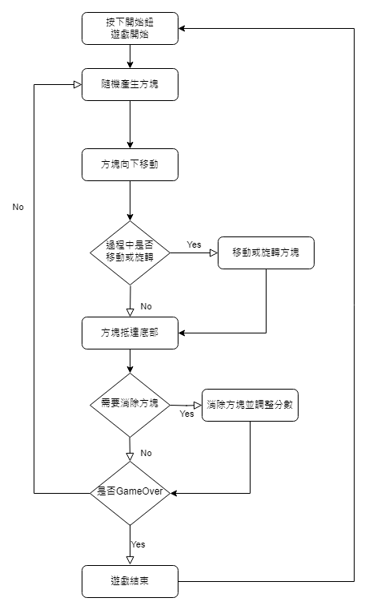

## React 實作俄羅斯方塊

這次的小作品使用React實作俄羅斯方塊遊戲，與一般俄羅斯方塊規則相同，只是在介面配置跟玩法上進行了一些簡化：


> * [作品原始碼](https://github.com/VickyShr/tetris-app "Title")
> * [遊戲成品](https://vickyshr.github.io/tetris-app/ "Title")


### 遊戲流程
先將整個遊戲流程規劃出來，對之後需要實作的功能有初步了解，再決定接下來有哪些任務需要完成：  



### 版面規劃
遊戲畫面預計分成兩欄，一欄是主要區塊，作為遊戲進行的區域，另一欄則放置遊戲相關的資訊：  


### 任務規劃
根據流程以及規畫出來的板塊，大致將整個遊戲規劃成以下幾個任務：
1. [資料結構選擇及方塊設定](./程式說明/1_1方塊設定.md "Title")
2. [使用ThemeProvider套用背景顏色到APP](./程式說明/2_使用ThemeProvider套用背景顏色到APP.md "Title")
3. [版面規劃](./程式說明/3_版面規劃.md "Title")
    1. 主內容區塊
        * 得分版
        * 遊戲區塊
        * 開始鍵
    2. 側邊欄
        * 方塊預告
        * 暫停鍵
4. [參數說明](./程式說明/4_參數說明.md "Title")
5. [產生新方塊](./程式說明/5_產生新方塊.md "Title")
6. [觸發按鍵](./程式說明/6_觸發按鍵.md "Title")
    * 方塊的移動
    * 方塊的旋轉
    * 方塊直接落到底部
7. [方塊的降落](./程式說明/7_方塊的降落.md "Title")
    * 方塊以特定速度下降
    * 方塊是否已經抵達位置
    * 到達底部後，更新遊戲

### 程式碼目錄結構：
程式的目錄按照規劃的任務進行區分，大致結構如下：

```
src
│  App.js
│  constants.js 
│  controlBlock.js
│  theme.js
│  
└─components
   ├─MainBoard                  
   │      index.js
   │      PlayBoard.js
   │      StartButton.js
   │      Title.js
   │      
   └─Sidebar                   
       │  index.js
       │  KeyDescribe.js
       │  PauseButton.js
       │  
       └─AllNextBlocks 
               index.js
               NextBlock.js
               ProduceNextBlock.js
```

<!-- 遊戲畫面否上調呢？ -->
### 遊戲畫面：  
  

