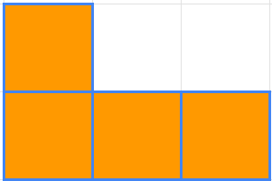

## 資料結構選擇及方塊設定

進入主題前，先認識組成俄羅斯方塊的七種方塊及其對應名稱：
| I | J | L | O | S | T | Z |
| :-: | :-: | :-: | :-: | :-: | :-: | :-: |
|  |  | | | | | |


遊戲預設在一個20列，10欄的盤面進行，但是紀錄盤面資料的方式可以選擇是一維陣列或二維陣列，這裡選用二維資料，看起來更加直覺。

關於一維資料呈現俄羅斯方塊的方法，可以參考[連結](./1_2使用一維資料呈現俄羅斯方塊.md "Title")。

### 使用二維資料呈現  
使用二維資料呈現的盤面：  


假設要在盤面上的某一個位置放入Z方塊：  
  

將該位置作為基準點，計算其他的位置：  
   
得到這個位置的公式為：
[[-1, -1], [-1, 0], [0, 0], [0, 1]]  
方塊的旋轉會導致不同的形態，根據不同型態再調整計算公式。

### 方塊的旋轉 

每個方塊經過旋轉後，擁有的型態數量並不相同：
1. 只有一種型態，沒有變化，例如oBlock：  
    

2. 只有兩種型態，例如zBlock：  

    | 型態一 | 型態二 |
    | :-: | :-: |
    |  |  | 

3. 擁有四種型態，例如jBlock：  
    | 型態一 | 型態二 | 型態三 | 型態四 |  
    | :-: | :-: | :-: | :-: |  
    |  |  |  |  |

其中只有兩種型態的方塊會在旋轉中遇到一些問題，這裡以zBlock為例，假設基準點以順時鐘方向對方塊進行旋轉：

| 旋轉一 | 旋轉二 | 旋轉三 | 旋轉四 |  
| :-: | :-: | :-: | :-: |  
|  |  |  |  |

其中的旋轉一跟旋轉三看起來是相同型態，但是計算方式卻不相同，也就是說在旋轉三轉回旋轉一的過程中，會出現方塊好像往上升的情況！

如果要處理這種情況，就是在旋轉二的時候，直接轉回旋轉一，但是這也導致了方塊一下順時針轉，一下又逆時針轉。

兩種方式各有利弊，選擇採取一致的順時鐘旋轉，將zBlock的四種旋轉狀態放入同一個陣列，進行旋轉的時候就可以計算不同狀態的位置：

```JS
const zBlock = [[[-1, 0], [-1, -1], [0, 1]],
                [[1, 0], [0, 1], [-1, 1]],
                [[0, -1], [1, 0], [1, 1]],
                [[-1, 0], [0, -1], [1, -1]]]
```


### 旋轉過程中需要注意的事

再以zBlock為例，假設zBlock以順時鐘方向，從旋轉一到旋轉二：
| 旋轉一 | 旋轉二 |
| :-: | :-: |
|  |  |

想知道這個旋轉是否合法，不僅要檢查旋轉二佔據的位置，還要檢查選轉過程中，會經過的位置：  
  
橘色的部分是檢查完下一個旋轉狀態後的所有位置，除此之外，還有一個旋轉途中經過的位置必須檢查。

可以觀察到，旋轉前要檢查的空間，其實就是：  
> <i>方塊的下一個狀態位置 - 目前狀態的位置 + 路過的位置 </i>

將方塊的四種狀態以及狀態旋轉時必須檢查的位置，作為map記錄下來後，方塊的初始設定就算完成：

```JS
/* 
./src/constant.js 
對盤面的寬高以及7種方塊進行設定
*/

export const WIDTH_GRID = 10;
export const HEIGHT_GRID = 20;

export const BLOCKS_MAP = {
    iBlock: {
        color: theme.default.blocks.iBlockColor,
        blockFill: [[[1, 0], [-1, 0], [-2, 0]],
        [[0, -1], [0, 1], [0, 2]],
        [[-1, 0], [1, 0], [2, 0]],
        [[0, -1], [0, -2], [0, 1]]],
        transPosCheck: [[[0, -1], [1, -1], [-2, 1], [-2, 2], [-1, 1], [-1, 2], [0, 1], [0, 2]],
        [[-1, -1], [-1, 0], [1, 0], [2, 0], [1, 1], [1, 2], [2, 1], [2, 2]],
        [[-1, 1], [0, 1], [0, -2], [0, -1], [1, -2], [1, -1], [2, -2], [2, -1]],
        [[1, 0], [1, 1], [-2, -2], [-1, -2], [-2, -1], [-1, -1], [-2, 0], [-1, 0]]]
    },
    jBlock: {
        color: theme.default.blocks.jBlockColor,
        blockFill: [[[0, -1], [-1, -1], [0, 1]],
        [[-1, 0], [-1, 1], [1, 0]],
        [[0, -1], [1, 1], [0, 1]],
        [[-1, 0], [1, 0], [1, -1]]],
        transPosCheck: [[[-1, 0], [-1, 1], [1, 0], [1, 1]],
        [[0, -1], [1, -1], [0, 1], [1, 1]],
        [[-1, -1], [-1, 0], [1, -1], [1, 0]],
        [[-1, -1], [0, -1], [-1, 1], [0, 1]]]
    },
    lBlock: {
        color: theme.default.blocks.lBlockColor,
        blockFill: [[[0, -1], [0, 1], [-1, 1]],
        [[-1, 0], [1, 0], [1, 1]],
        [[0, -1], [0, 1], [1, -1]],
        [[-1, 0], [1, 0], [-1, -1]]],
        transPosCheck: [[[-1, -1], [-1, 0], [1, 0], [1, 1]],
        [[0, -1], [1, -1], [-1, 1], [0, 1]],
        [[-1, -1], [-1, 0], [1, 0], [1, 1]],
        [[0, -1], [1, -1], [-1, 1], [0, 1]]]
    },
    oBlock: {
        color: theme.default.blocks.oBlockColor,
        blockFill: [[[0, 1], [-1, 0], [-1, 1]],
        [[0, 1], [-1, 0], [-1, 1]],
        [[0, 1], [-1, 0], [-1, 1]],
        [[0, 1], [-1, 0], [-1, 1]]],
        transPosCheck: [[[0, 0]], [[0, 0]], [[0, 0]], [[0, 0]]]
    },
    sBlock: {
        color: theme.default.blocks.sBlockColor,
        blockFill: [[[0, -1], [-1, 0], [-1, 1]],
        [[-1, 0], [0, 1], [1, 1]],
        [[1, 0], [1, -1], [0, 1]],
        [[0, -1], [-1, -1], [1, 0]]],
        transPosCheck: [[[-1, -1], [0, 1], [1, 1]],
        [[1, -1], [1, 0], [-1, 1]],
        [[-1, -1], [0, -1], [1, 1]],
        [[-1, 0], [-1, 1], [1, -1]]]
    },
    zBlock: {
        color: theme.default.blocks.zBlockColor,
        blockFill: [[[-1, 0], [-1, -1], [0, 1]],
        [[1, 0], [0, 1], [-1, 1]],
        [[0, -1], [1, 0], [1, 1]],
        [[-1, 0], [0, -1], [1, -1]]],
        transPosCheck: [[[-1, 1], [1, 1], [1, 0]],
        [[0, -1], [1, -1], [1, 1]],
        [[-1, -1], [-1, 0], [1, -1]],
        [[-1, -1], [-1, 1], [0, 1]]]
    },
    tBlock: {
        color: theme.default.blocks.tBlockColor,
        blockFill: [[[0, 1], [0, -1], [-1, 0]],
        [[-1, 0], [1, 0], [0, 1]],
        [[0, -1], [1, 0], [0, 1]],
        [[-1, 0], [1, 0], [0, -1]]],
        transPosCheck: [[[-1, -1], [-1, 1], [1, 0], [1, 1]],
        [[0, -1], [1, -1], [1, 1], [-1, 1]],
        [[-1, -1], [-1, 0], [1, -1], [1, 1]],
        [[-1, -1], [1, -1], [-1, 1], [0, 1]]]
    },
}
```