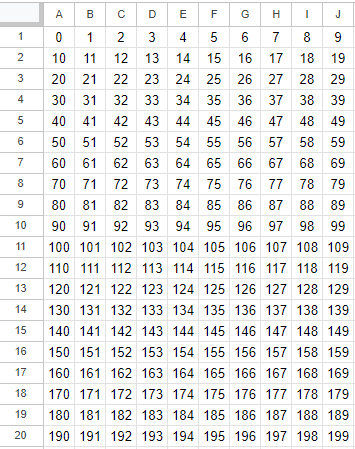
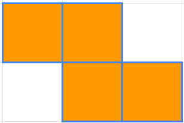
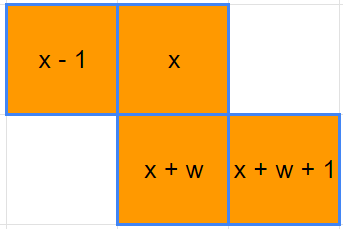
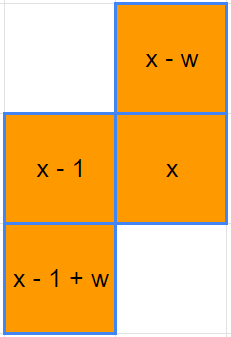
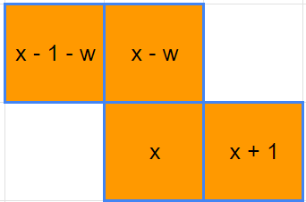
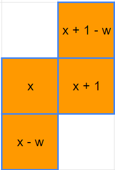

## 使用一維資料呈現俄羅斯方塊

使用一維資料呈現，模擬的盤面大概會長這樣：  


先不考慮旋轉後的狀況，假設要放入Z方塊：  
  
可以得到計算的陣列：[-1, 0, w, w + 1]，其中W是盤面目前的寬度，加上一個W相當於移到下一列同一個位置：  


將旋轉的四個狀態的計算方式放入同一陣列中，就可以計算出方塊出現在盤面上的位置：
```JS
const zBlock = [
    [-1, 0, w, w + 1],
    [-w, -1, 0, w - 1],
    [-1 - w, -w, 0, 1],
    [1 - w, 1, 0, -w],
]
```

| 狀態 | 計算陣列 | 狀態| 計算陣列 |
| :-: | :-: | :-: | :-: |
| I |  | II |  | 
| III |  | IV |  | 
