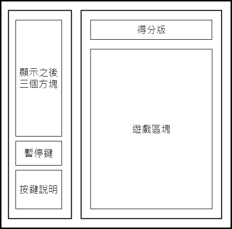
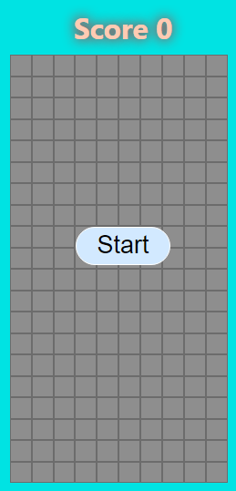
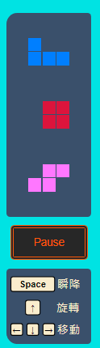
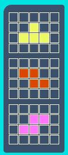

## 版面規劃

整個遊戲畫面預計分成兩欄，一欄是主要區塊，作為遊戲進行的區域，另一欄則放置遊戲相關的資訊：




* ### 主要區塊
主要區塊可以分為三個部分：
1. 遊戲區塊：主要進行遊戲的部分
2. 得分版：更新目前分數
3. 開始按鍵：遊戲開始前出現，按下後才會進入遊戲    

    

#### 遊戲區塊
遊戲區塊是一個二維矩陣的體現，使用Grid進行排版：

```JS
/* src/components/MainBoard/PlayBoard.js */

const GridContainer = styled.div`
    width: ${(WIDTH_GRID / HEIGHT_GRID) * 80}vh;
    height: 80vh;
    display: grid;
    grid-template-rows: repeat(${HEIGHT_GRID}, 1fr);
    grid-template-columns: repeat(${WIDTH_GRID}, 1fr);
    margin: 10px 10px 10px 0px;
`

const Square = styled.div`
    background-color: ${(props) => props.color};
    border: solid 1px ${(props) => props.theme.squareBorder};
`

function PlayBoard() {
  const squaresRow = Array(HEIGHT_GRID).fill(0).map((_, index) => index);
  const squareColumn = Array(WIDTH_GRID).fill(0).map((_, index) => index);

  return (
    <GridContainer>
      {
          squaresRow.map((row) => squareColumn.map((column) => {
              return (
                  <Square key={`${row}_${column}`} color={color} />
              )
          }))
      }
    </GridContainer>
  )
}
```

#### 得分版
得分板會在每有一層方塊被清除的時候，更新計分，消除一層就得一分：

```JS
/* src/components/MainBoard/Title.js */

const Score = styled.div`
  color: ${(props) => props.theme.titleFont};
  margin-top: 10px;
  font-size: 35px;
  font-weight: bold;
  text-shadow: 0px 0px 15px red;
`

function Title({ score }) {
  return (
    <Score >Score {score}</Score>
  )
}
```


#### 開始按鍵
Start Button預計放在遊戲區塊上，只在遊戲開始前出現，點擊按鈕後，遊戲才會正式開始。

為了讓其漂浮在遊戲區塊上，使用"position: absolute"的設定，定位到上層容器：

```JS
/* ./src/components/MainBoard/StartButton.js */

const Mask = styled.div`
    display: flex;
    position: absolute;
    height: 100%;
    align-items: center;
    justify-content: center;
`

const Button = styled.button`
    border: 2px solid #fff;
    color: ${props => props.theme.StartButtonFont};
    background-color: ${props => props.theme.startButtonColor};
    border-radius: 50px;
    font-size: 30px;
    padding: 5px 25px; 
    cursor: pointer;

    &:hover {
    color: ${props => props.theme.startHoverFont};
    background-color: ${props => props.theme.startHoverColor};
    transition: all 0.1s ease-in-out;
    }
`

function StartButton() {
    return (
        <Mask>
            <Button>Start</Button>
        </Mask>
    )
}
```

#### 完成主要區塊
再將得分版、遊戲區塊、開始按鍵組合在一起，並用isGameStart這個變數判斷遊戲是否開始，決定開始鍵是否出現，就大致完成主要區塊的部屬了：

```JS
/* src/components/MainBoard/index.js */

const MainBoardWrapper = styled.div`
    position: relative;
    padding: 10px ;
    background-color: ${(props) => props.theme.background};
    display: flex;
    flex-direction:  column;
    justify-content: center;
    align-items: center;
    height: 90vh;
`

function MainBoard({ score, gridColor, currentBlock, isGameStart, handleGameStart }) {
    return (
        <MainBoardWrapper>
            <Title score={score} />
            <PlayBoard gridColor={gridColor} currentBlock={currentBlock} />
            {
                !isGameStart && <StartButton handleGameStart={handleGameStart} />
            }
        </MainBoardWrapper>
    );
}
```


* ### 側邊欄
側邊欄會放置一些跟有遊戲有關的資料：
1. 方塊預告：預告接下來出現的三個方塊
2. 暫停鍵：遊戲進行到一半可以暫停的按鈕
3. 按鍵說明：按鍵的功能

        

#### 方塊預告

每一格預告的方塊也是一個二維陣列，並用Grid進行排版：  

 

```JS
/* src/components/Sidebar/AllNextBlocks/NextBlock.js */

const Blocks = styled.div`
    width: 90%;
    height: 100%;
    display: grid;
    grid-template-rows: repeat(${NEXT_BLOCK_HEIGHT}, 1fr);
    grid-template-columns: repeat(${NEXT_BLOCK_WIDTTH}, 1fr);
    grid-gap: 1.2px;
    margin-bottom: 10px;

    &:nth-child(1) {
        margin-top: 10px;
    }
`
const BlockSquare = styled.div`
    background-color: ${(props) => props.color ? props.color : props.theme.nextBlockBoard};
`

function NextBlock() {
    const blockRow = Array(NEXT_BLOCK_HEIGHT).fill(0).map((_, index) => index);
    const blockColumn = Array(NEXT_BLOCK_WIDTTH).fill(0).map((_, index) => index);

    return (
        <Blocks>
            blockRow.map((row) => blockColumn.map((column) => {
                return (
                  <BlockSquare key={`${row}_${column}`} color={boardColor}></BlockSquare>
                )
            }))
        </Blocks>
    )
}
```

因為有3個方塊預告，所以這個元件要使用3次：
```JS
/* src/components/Sidebar/AllNextBlocks/index.js */

const NextBlocksWrapper = styled.div`
    align-items: center;
    display: flex;
    flex-direction: column;
    margin-top: 40px;
    height: 45%;
    background-color: ${(props) => props.theme.nextBlockBoard};
    
    width: 80%;
    border-radius: 15px 5px 5px 5px;
    padding: 5px;
`

function AllNextBlocks() {
    let nextBlocksNum = 3;
    let nextBlockArr = Array(nextBlocksNum).fill(0).map((_, index) => index);

    return (
        <NextBlocksWrapper>
            {
                nextBlockArr.map((index) => {
                    return <NextBlock key={index} />
                })
            }
        </NextBlocksWrapper>
    );
}
```


#### 暫停鍵
用來控制遊戲流程的按鍵，這個按鍵會註冊事件，點擊之後，改變暫停的狀態：

```JS
/* src/App.js */

const handlePause = () => {
  setGamePause((prev) => !prev);
}
```

```JS
/* src/components/Sidebar/PauseButton/PauseButton.js */

const Button = styled.button`
    display: flex;
    align-items: center;
    justify-content: center;
    border: thick double  ${props => props.theme.pauseButtonFont};
    border-radius: 5px;
    background-color: ${props => props.theme.pauseButtonBackground};
    color: ${props => props.theme.pauseButtonFont};
    width: 80%;
    height: 8%;
    font-size: 15px;
    padding: 5px 25px; 
    margin-top: 12px;
    cursor: pointer;
    
    &:hover {
    color: ${props => props.theme.pauseHoverColor};
    background-color: ${props => props.theme.pauseHoverFont};
    transition: all 0.1s ease-in-out;
    }
`

function PauseButton({ handlePause, isPause, isGameStart }) {
    return (
        <Button onClick={handlePause}>
            {isGameStart && isPause ? "Continue" : "Pause"}
        </Button>
    );
}
```

#### 按鍵說明
將所有按鍵的說明做成一張圖，直接放入區塊：
```JS
/* src/components/Sidebar/PauseButton/KeyDescribe.js */

import { ReactComponent as Describes } from "../../../images/keyDescribe.svg";

const Wrapper = styled.div`
    margin-top: 12px;
    display: flex;
    width: 80%;
    background-color: ${(props) => props.theme.keyDescribeBoard};
    padding: 5px;
    border-radius: 5px 5px 5px 15px;

    svg {
        margin: 0px 0px 10px 0px;
        height: 100%;
    }
`

function KeyDescribe() {
    return (
        <Wrapper>
            <Describes />
        </Wrapper>
    );
}
```

#### 完成側邊欄區塊
再將方塊預告、暫停鍵、按鍵說明組合一起，側邊欄也完成了：

```JS
/* src/components/Sidebar/index.js */

const SideBarWrapper = styled.div`
    display: flex;
    flex-direction: column;
    width: 20vh;
    height: 90vh;
    align-items: center;
    justify-content: center;
    background-color: ${props => props.theme.sideBackground} ;
    border-radius: 30px 0px 0px 30px;
    padding: 10px ;
`

function SideBar({ blocks, handlePause, isPause, isGameStart }) {
    return (
        <SideBarWrapper>
            <AllNextBlocks blocks={blocks} />
            <PauseButton
                handlePause={handlePause}
                isPause={isPause}
                isGameStart={isGameStart}
            />
            <KeyDescribe></KeyDescribe>
        </SideBarWrapper>
    );
}
```