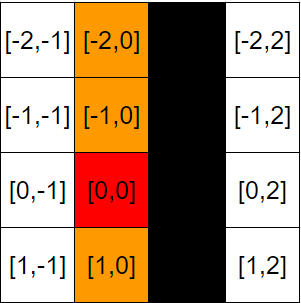

## 觸發按鍵

遊戲設定一共有五個按鍵可以觸發：
* 左、下、右：方塊的移動方向
* 上：旋轉方塊
* 空白鍵：讓方塊一鍵到底

### 對事件進行註冊
使用window.addEventListener註冊keydown事件，並且用useEffect控制觸發時機：

```JS
  useEffect(() => {
    if (!isGameStart || isPause) {
      return;
    }

    window.addEventListener('keydown', handleKeyDown);

    return () => {
      window.removeEventListener('keydown', handleKeyDown);
    }

  }, [handleKeyDown, isPause])
```

### 實作觸發的function

利用event傳進來的鍵值，轉換到對應的處理方式，再將方塊的位置進行更新：

```JS
const handleKeyDown = useCallback((event) => {
  const { keyCode } = event;

  setCurrentBlock((prevBlock) => {
    let { transitionLevel, pivotPoint } = prevBlock;

    switch (keyCode) {
      case ARROW_DOWN:
      case ARROW_LEFT:
      case ARROW_RIGHT:
        pivotPoint = changeMoveDirection(keyCode, prevBlock, gridColor) || pivotPoint;
        break;
      case ARROW_SPACE:
        pivotPoint = straightDownToBottom(prevBlock, gridColor) || pivotPoint;
        break;
      case TRANSITION_KEY1:
        [transitionLevel, pivotPoint] = handleTransition(prevBlock, gridColor);
        break;
    }

    return {
      ...prevBlock,
      pivotPoint: pivotPoint,
      transitionLevel: transitionLevel
    };
  });
}, [currentBlock]);
```

* #### 移動

只有左、下、右三個按鍵會進入移動的函式，再根據三個按鍵的方向，檢查是否撞到邊界或其他方塊，決定是否將pivotPoint移動到新位置：

```JS
/* 
./src/controlBlock.js
*/

export const changeMoveDirection = (keyCode, currentBlock, gridColor) => {
    let newfillSections = [];
    let directionChange = [];
    let newPivot = [...currentBlock["pivotPoint"]];
    let blockFill = currentBlock["blockFill"][currentBlock.transitionLevel];

    switch (keyCode) {
        case ARROW_LEFT:
        case ARROW_RIGHT:
            directionChange[0] = 0;
            directionChange[1] = keyCode === ARROW_LEFT ? -1 : 1;
            break;
        case ARROW_DOWN:
            directionChange[0] = 1;
            directionChange[1] = 0;
            break;
        default:
            return;
    }

    newPivot[0] += directionChange[0];
    newPivot[1] += directionChange[1];

    newfillSections = blockFill.map(([x, y]) => [parseInt(x) + newPivot[0], parseInt(y) + newPivot[1]])
    newfillSections.push(newPivot);

    if (isTouchBottom(newfillSections, gridColor)) {
        return;
    }

    if (isTouchLeftOrRight(newfillSections, gridColor)) {
        return;
    }

    return newPivot;
}
```

* #### 旋轉

方塊旋轉的時候，不僅要檢查旋轉後的位置會不會撞到邊界或方塊，還要檢查旋轉過程中，會不會撞到其他方塊：

| 旋轉一 | 旋轉二 | 檢查位置 |
| :-: | :-: |:-: |
|  |  | |

[x+1, y+1]這個位置，如果只檢查旋轉後的位置，是會被忽略的，所以用一張表列出以pivotPoint為中心，需要檢查的所有位置：
> <i>方塊的下一個狀態位置 - 目前狀態的位置 + 路過的位置 </i>  

以zBlock為例：

```JS
zBlock: {
    color: theme.default.blocks.zBlockColor,
    blockFill: [[[-1, 0], [-1, -1], [0, 1]],
    [[1, 0], [0, 1], [-1, 1]],
    [[0, -1], [1, 0], [1, 1]],
    [[-1, 0], [0, -1], [1, -1]]],
    transPosCheck: [[[-1, 1], [1, 1], [1, 0]],
    [[0, -1], [1, -1], [1, 1]],
    [[-1, -1], [-1, 0], [1, -1]],
    [[-1, -1], [-1, 1], [0, 1]]]
}
```
還有一個需要調整的地方是，以iBlock的前兩個狀態為例：
| 旋轉一 | 旋轉二 | 
| :-: | :-: |
|  |  |

如果旋轉一目前是在最左或最右邊的欄，會無法進行旋轉：
| 最左邊 | 最右邊 | 
| :-: | :-: |
|  |  |

遇到這種狀況，如果將pivotPoint水平左移或右移之後，可以進行旋轉，就會自動將其移動：

```JS
/* 
./src/controlBlock.js
先檢查旋轉後是否觸碰邊界，
如果觸碰邊界，水平移動pivotPoint後，檢查旋轉是否碰到其他障礙物
*/

function isTransCollision(currentBlock, gridColor) {
  let collision = null, transCheckSections = null;;
  let curPivot = [...currentBlock.pivotPoint];
  let { transPosCheck, blockFill } = BLOCKS_MAP[currentBlock.curBlock];
  let minY = 0, maxY = WIDTH_GRID - 1;


  transPosCheck = transPosCheck[currentBlock.transitionLevel];
  transCheckSections = transPosCheck.map(([x, y]) => [x + curPivot[0], y + curPivot[1]]);

  transCheckSections.forEach(([x, y]) => minY = y < minY ? y : minY);
  transCheckSections.forEach(([x, y]) => maxY = y > maxY ? y : maxY);

  curPivot[1] = minY < 0 ? curPivot[1] - minY : curPivot[1];
  curPivot[1] = maxY > WIDTH_GRID - 1 ? curPivot[1] - (maxY - WIDTH_GRID + 1) : curPivot[1];

  if (curPivot[1] !== currentBlock.pivotPoint[1]) {
      let checkPos = null;

      blockFill = blockFill[currentBlock.transitionLevel]
      checkPos = blockFill.concat(transPosCheck);

      transCheckSections = checkPos.map(([x, y]) => [x + curPivot[0], y + curPivot[1]]);
      transCheckSections.push(curPivot);
  }

  collision = isTouchBottom(transCheckSections, gridColor) || isTouchLeftOrRight(transCheckSections, gridColor);
  curPivot = collision ? currentBlock.pivotPoint : curPivot;

  return [collision, curPivot]
}

export const handleTransition = (currentBlock, gridColor) => {
    let [isCollision, curPivot] = isTransCollision(currentBlock, gridColor);
    let curLevel = currentBlock.transitionLevel;
    curLevel = isCollision ? curLevel : (curLevel + 1) % 4;

    return [curLevel, curPivot];
}
```


* #### 瞬降
一列列向下檢查，直到觸碰到障礙物，就是新的pivotPoint位置：

```JS
export const straightDownToBottom = (currentBlock, gridColor) => {
    const newPivot = [...currentBlock["pivotPoint"]];
    const blockFill = currentBlock["blockFill"][currentBlock.transitionLevel];
    let newfillSections = blockFill.map(([x, y]) => [parseInt(x) + newPivot[0], parseInt(y) + newPivot[1]]);
    newfillSections.push(newPivot);

    while (!isTouchBottom(newfillSections, gridColor)) {
        newPivot[0]++;
        newfillSections = blockFill.map(([x, y]) => [parseInt(x) + newPivot[0], parseInt(y) + newPivot[1]]);
        newfillSections.push(newPivot);
    }

    newPivot[0]--;

    return newPivot;
}
```