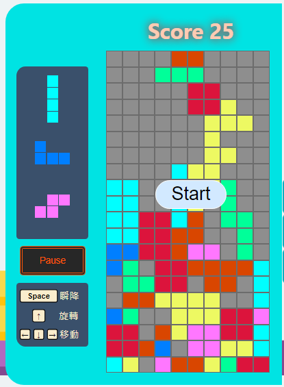

## 方塊的降落

方塊每隔一段時間，就會下降一格，在這過程中，不僅要控制降落速度，還要檢查是否已經到達底部，所以將這個步驟規劃成更小的步驟進行實作：
1. 方塊以特定速度下降
2. 方塊是否已經抵達位置
3. 到達底部後，後續的動作

#### 方塊以特定速度下降

控制降落的方法及速度，就用setInterval()進行控制。

影響setInterval產生及取消的，有三種狀況：  
1. 遊戲開始 / 結束的時候
2. 遊戲暫停 / 繼續的時候
3. 方塊進行輪替的時候

建立三個變數進行紀錄，並作為useEffect的dependencies，決定setInterval()的執行時機：

```JS
/* ./src/App.js */

const [isGameStart, setGameStart] = useState(false);
const [isPause, setGamePause] = useState(false);
const [isNewBlock, setIsNewBlock] = useState(0);
const [speed, setSpeed] = useState(INITIAL_SPEED);

useEffect(() => {
    if (!isGameStart || isPause) {
      return;
    }

    const blockIntervalId = setInterval(() => {
        /* 
            設定每隔speed時間就下降一格，並且更新目前方塊的狀態 
        */
    }, speed);

    return (() => { clearInterval(blockIntervalId) });
}, [isGameStart, isPause, isNewBlock]);
```


### 方塊是否已經抵達位置

降落的過程中，檢查是否碰撞，如果發生碰撞，代表方塊已經抵達目標位置。

根據方塊紀錄的pivotPoint可以知道目前的所在位置 [ x座標, y座標 ]：

```JS
const defaultBlock = {
curBlock: null,
color: null,
blockFill: null,
transitionLevel: 0,
// 預設 PIVOT_POINT = [0, 4]
pivotPoint: PIVOT_POINT,
}

const [currentBlock, setCurrentBlock] = useState(defaultBlock);
```

讓setInterval()執行的時候，將pivotPoint向下移動，並且檢查這個移動是否跟下面的方塊產生碰撞，碰撞的兩種可能：
  1. 到達底部
  2. 碰到別的方塊
```JS
/* src/controlBlock.js */

export function isTouchBottom(fillSections, gridColor) {
  let collision = fillSections.find(([x, y]) => {
      if (x < 0) {
          return false;
      }
      return (x >= HEIGHT_GRID) || (gridColor[x][y] !== SQUARE_COLOR);
  })

  return collision;
}
```

```JS
/* src/App.js */
const blockIntervalId = setInterval(() => {
      setCurrentBlock((prevBlock) => {
        let newPivot = [prevBlock.pivotPoint[0] + 1, prevBlock.pivotPoint[1]];
        let blockFill = prevBlock["blockFill"][prevBlock.transitionLevel];

        let fillSections = blockFill.map(([x, y]) => [parseInt(x) + newPivot[0], parseInt(y) + newPivot[1]])
        fillSections.push(newPivot);

        let collision = isTouchBottom(fillSections, gridColor);

        if (collision) {
          /* 
            發現碰撞，代表抵達目標位置，
            針對這個狀況進行處理
          */
        }

        return {
          ...prevBlock,
          pivotPoint: newPivot,
        }
      })
    }, speed);
```


#### 方塊抵達位置

方塊到達目標位置後，執行：  
  1. 檢查每一列每一格的顏色，如果出現盤面的預設顏色，代表該列未被填滿，保留該列，否則將該列清除，將上面的列向下進行替補
  2. 消除的列數加進目前的得分  
  3. 根據目前的分數修改速度
  4. 更新盤面的顏色
  5. 更新isNewBlock的狀態，讓產生新方塊的useEffect的dependencies發生改變
  6. 設定遊戲狀態是否結束

```JS
/* src/App.js */

if (collision) {
  let { clearLevels, newGridColor, gameover } = handleBottomCollision(fillSections, gridColor, prevBlock.color);
  let newScore = score + clearLevels

  setGridColor(newGridColor);
  setScore(newScore);
  setSpeed(() => {
    let newSpeed = INITIAL_SPEED - Math.floor(newScore / 5) * DELTA_SPEED;
    newSpeed = Math.max(MIN_SPEED, newSpeed);

    return newSpeed;
  })
  setIsNewBlock(prev => prev + 1);
  setGameStart(!gameover);

  return prevBlock;
}
```

#### 遊戲結束
setInterval設定方塊以固定下降的時候，發生碰撞時使用setGameStart()更新狀態。

如果遊戲結束，開始按鍵重新出現，按下開始鍵後，回復預設值，遊戲重新開始：  

  


```JS
/* src/App.js */

function App() {

  /* 省略其他程式碼 */

  const handleGameStart = () => {
    setGridColor(defaultGridColor);
    setNextBlocks([])
    setCurrentBlock(defaultBlock);
    setScore(0);
    setGameStart(true);
    setSpeed(INITIAL_SPEED);
    setIsNewBlock(0);
  }

  return (
    <ThemeProvider theme={themes["style"]}>
      <Container>
        <SideBar/>
        <MainBoard
          handleGameStart={handleGameStart}
        />
      </Container>
    </ThemeProvider>
  );
}
```

將function註冊到Start Button上，按下Start Button後回復預設值，遊戲重新開始：

```JS
/* ./src/src/components/MainBoard/StartButton.js */ 
function StartButton({ handleGameStart }) {
    return (
        <Mask>
            <Button onClick={handleGameStart}>
                Start
            </Button>
        </Mask>
    )
}
```